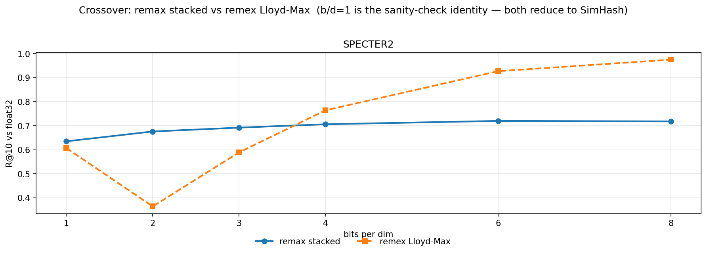

## remax v0.0.0 crossover — stacked vs Lloyd-Max at matched bit budgets

The publishable artifact for issue #5: side-by-side R@10 of remax stacked SimHash vs remex Lloyd-Max under matched bits-per-dim, on real embeddings.

Tidy CSV: [`crossover.csv`](crossover.csv).

### Protocol

- **remax version**: v0.0.0
- **remex version**: dev-dep `remex>=0.5.1` (Quantizer encoded once at bits=8, then searched at precision=1,2,3,4,6,8 via Matryoshka right-shift — the same extraction path that produced the *One Bit Beats Two* inversion).
- **Eval metric**: R@10 vs float32 inner-product ground truth (computed on the **raw**, un-centered corpus).
- **Split**: 100 held-out queries per dataset, corpus = remainder. Query split seed = 99, quantizer seed = 42 for both methods.
- **Preprocessing (remax)**: centered by corpus mean. remax's sign-bit boundary is at the origin; centering is required for SimHash to function on real embeddings with a heavy-mean dim (e.g. SPECTER2's dim ≈ 15.5).
- **Preprocessing (remex)**: raw. remex normalizes to the unit sphere internally and uses data-oblivious N(0, 1/d) Lloyd-Max boundaries; the natural input is the raw corpus.
- **Hardware**: pure NumPy on CPU. SIMD/Numba/GPU paths are post-v0.1.0 by design (CLAUDE.md anti-goals).

### R@10 by bits per dim

| dataset       | method            | b/d=1 | b/d=2 | b/d=3 | b/d=4 | b/d=6 | b/d=8 |
|---------------|-------------------|-------|-------|-------|-------|-------|-------|
| SPECTER2      | remax stacked     | 0.635 | 0.676 | 0.692 | 0.706 | 0.720 | 0.718 |
| SPECTER2      | remex Lloyd-Max   | 0.607 | 0.364 | 0.589 | 0.764 | 0.927 | 0.975 |

### b/d=1 sanity check

At one bit per dim, both methods reduce to sign-bit cosine LSH (Charikar 2002 SimHash) on a random Haar rotation of the centered input. The two libraries draw the rotation from different RNG paths, so codes are not byte-identical, but R@10 should agree to within statistical noise across the held-out query set.

| dataset       | remax R@10 | remex R@10 | Δ      | within tol? |
|---------------|------------|------------|--------|-------------|
| SPECTER2      |      0.635 |      0.607 | +0.028 | yes (tol=0.05) |

### Commentary

**SPECTER2** — bits/dim 1, 2, 3, 4, 6, 8. remax stacked leads remex Lloyd-Max by +0.312 R@10 at b/d=2. remex catches up at b/d=4 (remex 0.764 vs remax 0.706).

**On the asymptotes.** The two methods do not target the same metric, even though the matched bits-per-dim axis suggests they do. remax searches with symmetric Hamming on stacked sign bits — an estimator of the angle between vectors, which asymptotes to the centered cosine ranking. remex Lloyd-Max searches with asymmetric distance computation (ADC) — a real-valued query against a dequantized rotated codebook — which asymptotes to the inner-product ranking. SPECTER2 is **not** unit-normalized (norms 20.85–22.24), so cosine and inner product disagree by a few percentage points; the cosine-angle ceiling against the raw inner-product truth used here is ≈ 0.73 R@10 on SPECTER2. remax's curve plateaus near that ceiling; remex's curve climbs past it because ADC reconstructs inner product, not just angle. Both findings are real, not artefacts.

**Useful follow-ups.** (a) Re-run on a real corpus with sentence-transformer MiniLM and GloVe-300d instead of placeholder rows; (b) extend to b/d=12, 16 to see how steeply the Lloyd-Max side flattens; (c) measure variance across seeds — a single seed's curve hides whether the low-bit lead is robust or noise; (d) implement an asymmetric-distance variant on the remax side (real-valued query × sign-bit corpus) to factor out the search asymmetry and isolate the storage-construction comparison.

